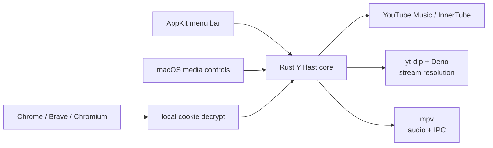

# YTfast for macOS

A lean native **YouTube Music menu-bar player**.

The macOS release is intentionally not a desktop music app: one AppKit status item controls the existing Rust YouTube Music/player core. No WebView, egui window, artwork cache or background rendering loop is shipped in the Mac package.

**Previous · Play/Pause · Next · Shuffle · Volume · Library · Add to playlist**

### Current macOS UI


*Actual AppKit menu captured from the current macOS build with fixture track data; no image from the upstream desktop fork.*


## Install

Requirements:

```sh
brew install mpv yt-dlp deno
```

Then:

1. Quit any old YTfast instance.
2. Unzip the Apple Silicon build.
3. Replace `/Applications/YTfast.app`.
4. Open YTfast.
5. Use the **music-note** item in the menu bar.

YTfast is currently ad-hoc signed, not notarized.

### Sign in

Sign in to YouTube Music in **Chrome, Brave or Chromium**, then use:

**YTfast → Account → Reconnect**

macOS may ask for:

- access to the browser's protected files;
- the browser's **Safe Storage** Keychain item.

The Safe Storage secret is read locally and used locally to decrypt the browser's YouTube cookies. YTfast does not have a sign-in server. Authenticated requests then go directly to YouTube/Google as normal.

Safari and Firefox sessions are not supported.

## What the Mac build does

### Playback

- audio-only playback through `mpv`;
- existing YouTube Music stream-quality selection;
- current + next track preparation;
- queue/session persistence;
- pause, seek, next/previous, volume and shuffle;
- macOS Now Playing / media-key integration.

### Library

The native menu exposes:

- Playlists;
- Liked Music;
- Albums;
- playlist/song selection;
- **Add song to playlist** for server-confirmed editable playlists.

Library data is loaded when the relevant menu is opened instead of keeping a full music UI resident.

### Resource direction

The Mac build deliberately excludes the desktop rendering stack:

- no egui/eframe/winit renderer;
- no GPU UI backend;
- no full application window;
- no artwork fetching for the menu;
- no Home feed or lyrics surface;
- no UI polling/repaint loop.

A controlled same-runner CI comparison reduced idle app RSS from about **174 MB to 33 MB** versus the previous visible-window Mac port. That is a signed-out synthetic comparison, not a promise for a live playback session. See [current state and evidence](docs/CURRENT.md).

## Architecture



The menu, macOS media controls and CLI all drive the **same player state**. There is no second menu-bar player.

The circular play control macOS may show is the system's global **Now Playing** item, not another YTfast process.

## Build

On macOS 13+ with Rust 1.98+ and Xcode Command Line Tools:

```sh
scripts/build-macos.sh
open dist/YTfast.app
```

The build produces `dist/YTfast.app` and an architecture-labelled ZIP.

The retained upstream desktop UI remains available for Linux/development through the default `desktop-ui` feature. It is **not** part of the Mac menu-bar package.

## Documentation

- [macOS product + architecture contract](docs/MACOS.md)
- [current tested state, measurements and limits](docs/CURRENT.md)
- [agent/development rules](AGENTS.md)
- [inherited desktop product spec](docs/SPEC.md) — legacy desktop reference
- [inherited integration research](docs/integration.md) — dated technical evidence

Current docs override historical desktop assumptions for the Mac build.

## Credits

Fork of [MayberryDT/ytfast](https://github.com/MayberryDT/ytfast), by Tyler Mayberry.

The existing Rust YouTube Music client, account logic, queue and playback engine remain the core. [Sonora](https://github.com/sonorahq/sonora) informed the **architecture only**: separate player/provider logic from UI, keep one player owner, preload only useful upcoming media and use explicit resource bounds. No Sonora source or GPUI dependency is included.

MIT. Unofficial and not affiliated with YouTube or Google.
