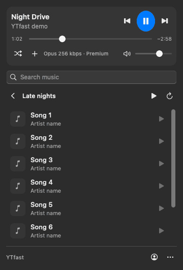
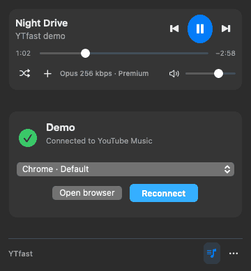

# YTfast for macOS

**YouTube Music in your menu bar. Native, fast and lightweight.** Browse your library and control playback without a WebView, browser player or Dock window.

[**Download current build · Apple Silicon**](https://github.com/Xon333/ytfast-macos/actions/runs/37808615571/artifacts/11564426394) · [CI builds](https://github.com/Xon333/ytfast-macos/actions/workflows/ci.yml) · [Verified changes](docs/CURRENT.md)

<p align="center">
  
  
  
</p>
<p align="center"><sub>Earlier native layout with example data. Fresh dark-theme captures are included in the current download.</sub></p>

## Install

**Apple Silicon · macOS 13+**

1. Install the audio tools (mpv 0.41+; skip if already installed):

   ```sh
   brew install mpv yt-dlp deno
   ```

2. Download the build above. **Unzip twice:** first the GitHub Actions download, then `dist/ytfast-macos-arm64.zip` inside it.
3. Quit any running YTfast, then move `YTfast.app` to **Applications**, replacing the old version. Open it and click the music-note item in the menu bar.

The app is ad-hoc signed, not notarized. If macOS blocks it, use **System Settings → Privacy & Security → Open Anyway**.

## Connect YouTube Music

1. **Sign in** to YouTube Music in **Chrome, Brave or Chromium**, using the browser profile shown in YTfast.
2. Return to YTfast and select **Connect / Reconnect**. Approve the browser **Safe Storage** Keychain request if prompted.
3. If browser access is blocked, choose **Allow Full Disk Access…**, enable YTfast under **Privacy & Security → Full Disk Access**, then quit, reopen and reconnect.

Safari and Firefox sessions are not supported. Credentials are handled locally; authenticated requests go directly to YouTube/Google. No YTfast sign-in server or telemetry.

## Features

- **Player:** play/pause, next/previous, seek, volume, mute, shuffle, macOS media keys and Now Playing.
- **Library:** Search, Playlists, Liked and Albums; inline navigation, keyboard control and Add to playlist.
- **Dark native controls:** Catppuccin Mocha colours, lavender accents and compact reusable AppKit components; dark even under a light system appearance.
- **Source-quality audio:** direct mpv playback, with Premium Opus/AAC selected by yt-dlp when available. No transcoding or artificial enhancement.
- **Quick starts:** stream lookup and player startup overlap queue loading; valid streams can be reused across launches.
- **Small footprint:** AppKit + Rust, reusable rows, no WebView or idle audio helpers; mpv uses its embedding profile without unused console/overlay scripts.

**Shortcuts:** `⌘F` search · `⌘R` refresh · `Space` play/pause · `Return` select · `Esc` back · `⌘Q` quit

<details>
<summary>Build from source</summary>

Requires Rust 1.98+, Xcode Command Line Tools and the audio tools above.

```sh
scripts/build-macos.sh
open dist/YTfast.app
```

The build also produces `dist/ytfast-macos-<arch>.zip`. See [architecture](docs/MACOS.md) and [test evidence](docs/CURRENT.md).

</details>

---

Based on [MayberryDT/ytfast](https://github.com/MayberryDT/ytfast) (MIT). Native controls adapt source from [Mino](https://github.com/nad-bit/Mino) and [MacControlCenterUI](https://github.com/orchetect/MacControlCenterUI); colours reuse [Catppuccin Mocha](https://github.com/catppuccin/palette). Their MIT notices are bundled. Design reference: [Radio](https://github.com/pom11/Radio); playback reference: [Sonora](https://github.com/sonorahq/sonora). [License](LICENSE).

*Unofficial. Not affiliated with YouTube or Google.*
