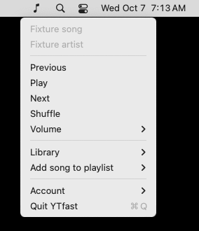

# YTfast for macOS

A lean native **YouTube Music menu-bar player**. One AppKit popover keeps playback controls, search and your library together.

**Previous · Play/Pause · Next · Shuffle · Seek · Volume · Search · Playlists · Liked Music · Albums**



*Captured from the native app with example music data.*

## Install

Install the audio and stream-resolution tools:

```sh
brew install mpv yt-dlp deno
```

Quit YTfast, unzip the Apple Silicon build, replace `/Applications/YTfast.app`, and open it. Click the **music-note** item in the menu bar.

The app supports macOS 13+ and is currently ad-hoc signed, without notarization.

### Connect your account

1. Open **Account → Open YouTube Music to sign in**. YTfast opens the selected supported browser.
2. Sign in to YouTube Music in the selected **Chrome, Brave or Chromium** profile. The browser may initially open its last-used profile.
3. Choose **Account → Reconnect**. Allow the browser's **Safe Storage** Keychain prompt if macOS asks.
4. If access to the cookie store is blocked, use **Account → Full Disk Access…** to allow YTfast in System Settings, then quit and reopen YTfast.

Account shows the selected browser/profile and connection state. A failed selection never silently connects a different account. Safari and Firefox sessions are not supported.

The browser secret is read and used locally. Authenticated requests go directly to YouTube/Google; YTfast has no sign-in server.

## Using the player

- **Playback stays visible** while you browse. The progress and volume sliders, media keys and macOS Now Playing controls use the same player.
- **Search or choose a library section** directly. Open playlists and albums inline, use Back to return, and Load more for additional results.
- **Refresh keeps the current list usable.** Saved pages from the same browser session appear while fresh data loads.
- **Add the playing song** with the plus control, then choose an editable playlist. The captured song stays the add target if playback advances.
- **Loading and errors stay visible.** Play/Pause can cancel a pending start; closing the popover leaves playback running.

## Playback and resources

The Rust core owns the queue, YouTube API, account writes and playback state. `yt-dlp` with Deno resolves audio, and `mpv` plays it. The native shell has no WebView, egui/eframe/winit renderer, artwork fetching or repaint loop.

Current and next-track preparation overlap with player startup. Stream URLs and library snapshots are bounded and account-scoped. Premium-capable format selection is retained; enabled loudness normalization attenuates tracks without adding positive gain.

The app restores its saved queue paused. Audio/resolver helpers start when playback is requested. macOS may also show its own global **Now Playing** item.

Exact limits and current verification are in [macOS architecture](docs/MACOS.md) and [current state](docs/CURRENT.md).

## Build

On macOS with Rust 1.98+ and Xcode Command Line Tools:

```sh
scripts/build-macos.sh
open dist/YTfast.app
```

Outputs are `dist/YTfast.app` and `dist/ytfast-macos-<arch>.zip`. The optional `desktop-ui` Cargo feature is a separate Linux/development target and is excluded from the Mac package.

## Development

- [Current macOS product and architecture](docs/MACOS.md)
- [Verified state and evidence](docs/CURRENT.md)
- [Contributor guidance](AGENTS.md)
- [Inherited desktop specification](docs/SPEC.md) and [dated integration research](docs/integration.md)

Current source, observed behavior and user direction take precedence over inherited implementation assumptions.

## Credits

Fork of [MayberryDT/ytfast](https://github.com/MayberryDT/ytfast), by Tyler Mayberry.

[Sonora](https://github.com/sonorahq/sonora) informed architectural decisions about playback preparation, snapshots, account isolation and native interaction. No GPL source was copied into this MIT project.

Unofficial and not affiliated with YouTube or Google.
